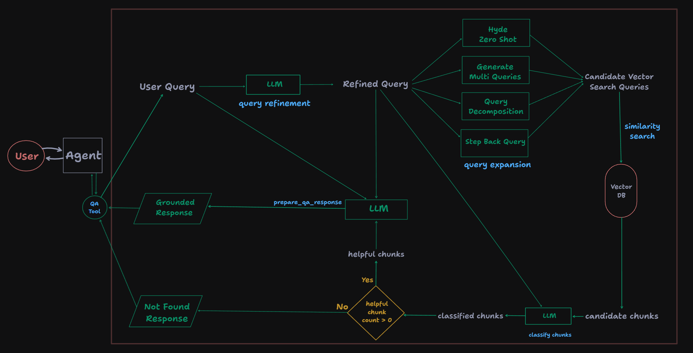
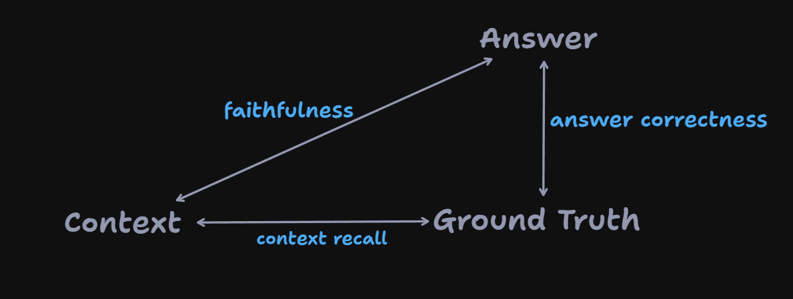
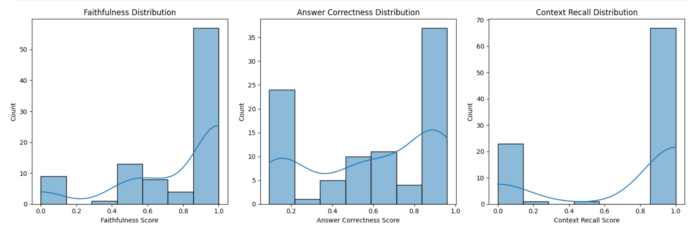
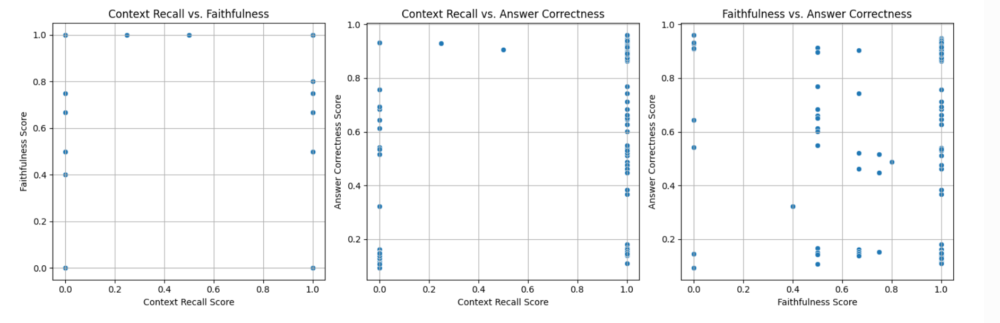
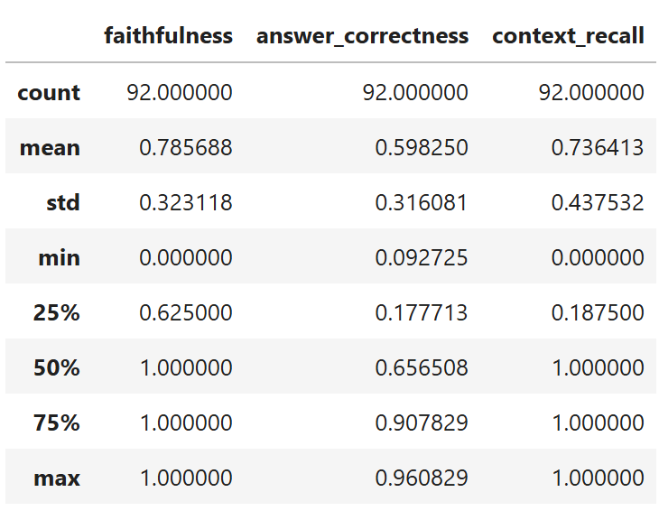

# RAG and Evaluations

This repository contains an experimental autonomous RAG system evaluated with the RAGAS framework on HotPotQA dataset.
Built workflow demonstrates strong grounding behavior with identified improvement areas in context recall consistency and answer synthesis capabilities.
Below are the details on what this repo currently has and what are the future steps.

## Repository Structure

```
.
├── evaluation/     # Evaluation and analysis notebooks, and data
├── rag_app/        # Brain of the rag workflows
├── vector_db/      # ChromaDB vector db client
└── msc/            # ad hoc files
```


## RAG Design Overview

**RAG Workflow Illustrated as a tool to a potential conversational agent**




## Evaluation Results

**Triangle of RAGAS Metrics used in the evaluation**
- Edges are the used metrics
- Vertexes are the related entities



**Distribution of metrics**



**Scatter plots of metrics combinations for relationships**



**Descriptive statistics of the metrics**




## Evaluation Summary
The RAG pipeline demonstrates strong grounding/non-hallucinating behaviour (Faithfulness: 0.79). However, there seems to be an inconsistency with retrieval accuracy, potentially caused by the polarized/bi-modal distribution of context recall (0.74). The system currently exhibits an "all-or-nothing" performance on context recall.

Despite high faithfulness and context recall on average, the Answer Correctness (0.60) indicates a contextual noise, irrelevancy, synthesis bottleneck. Even when relevant data is retrieved, there are cases of models failing to generate an accurate response.

### Potential improvement areas

- Transitioning to semantic chunking over fixed-length chunking can help prevent fracturing semantic context and significantly better scores.
- Chunk re-ranking before LLM as a judge to prevent lost-in-the-middle issues and reduce computation costs.
- Alternative and/or fine tuned models to gemini flash 2.0 for synthesis bottleneck.

## Technologies

- **Evaluation Framework**: RAGAS
- **Dataset**: HotPotQA
- **Vector Database**: ChromaDB
- **LLM**: Gemini Flash 2.0
diagrams: https://www.tldraw.com/f/iap9EKd03_FfLR9L1bAp1


## Future Steps

I plan to work more on RAG systems. This system can be improved significantly and already there are clear points of improvements. However, although they provided insights and room for growth, instead of just fixing those based on this evaluation of one framework with one dataset, I will do these:
- more research on built RAG systems and the state of the art
    - this means reading more papers, spending significant time on arxiv, discussions with peers and lots of experimentations.
    - this means time
- experiment with different systems
- experiment with deep research and needle in the haystack, for example with this repository of a workshop: https://github.com/IssamLaradji/agentcon_deep_research
- experiment with local models and cost-friendly evaluation pipelines
    - this is needed to test more comprehensively.

Why?
Because I want to learn more on building robust system and see this as the way to do it.

